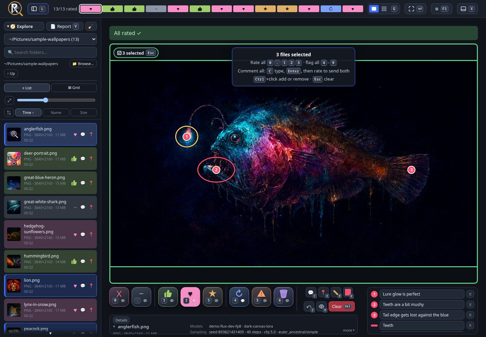

# Simple Media Rater

Tiny local web app for rating generated images and music one file at a time. Python standard library only: no install, no build.



## Setup

- **Required:** Python 3.10+ and a modern browser. Nothing to install: clone and run.
- **Optional, for Browse…:** on Linux, PyGObject (`python3-gobject` on Fedora, `python3-gi` on Debian/Ubuntu) plus a running `xdg-desktop-portal`, which most desktops ship. Without it, Browse… falls back to Tk (`python3-tkinter` / `python3-tk`). Without either, type the folder path instead.
- **Folders:** pass `--root` per media folder, or set `MEDIA_RATER_ROOTS` once (e.g. in `~/.config/environment.d/`).

```bash
git clone https://github.com/philipplinux/simple-media-rater
cd simple-media-rater
python3 server.py                          # scans the current directory → http://127.0.0.1:8765/
python3 server.py --root ~/Pictures --root ~/Music --port 8765
```

## Use

- Pick a discovered folder (scans the roots up to 4 levels deep) or type/browse to any local folder. Roots: `--root` (repeatable), else `MEDIA_RATER_ROOTS` (colon-separated), else the current directory.
- **1–5** rate (Reject · Neutral · Good · Great · Love) and advance; **← →** navigate; **C** comment; **Space** play/pause audio.
- **Click an image** for fullscreen: **Ctrl+wheel** zooms at the cursor, drag pans, click or Esc closes.
- Ratings are stored per folder in `.review.json`, and `REVIEW.md` is rebuilt on every change: a Markdown summary an LLM can read to learn your taste.

Images: PNG, JPG, WebP, GIF. Audio: MP3, FLAC, WAV, OGG, M4A, Opus. Listens on IPv4 loopback only; cross-origin POSTs are rejected. **Browse…** opens the system folder dialog via the XDG desktop portal (needs PyGObject), falling back to Tk.

## License

MIT, see [LICENSE](LICENSE).
