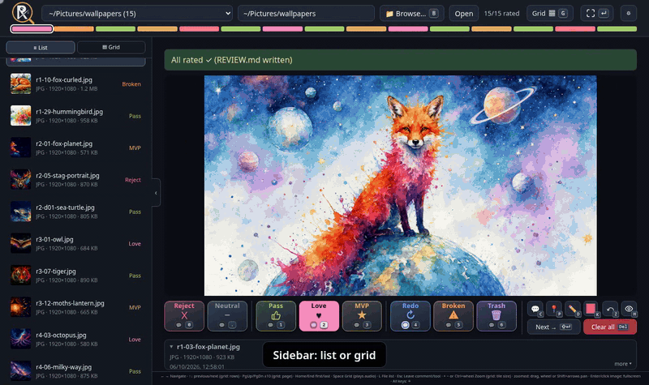

# RateBait

Tiny local web app for rating AI-generated images and music fast: numpad keys to rate (Reject → MVP) and flag (Redo, Broken, Trash), a comment per file, pins and drawings over the picture, a scrollable grid view, and a `REVIEW.md` summary per folder that an LLM can read to learn your taste. Python standard library only: no install, no build.

Made for a 4K screen at 50 inches. ¯\\\_(ツ)\_/¯ Screenshots: [docs/screenshot.png](docs/screenshot.png), full-size 4K [docs/screenshot-4k.jpg](docs/screenshot-4k.jpg).



<details><summary><b>More demos:</b> navigation, annotation, 4K vs low-res at the same zoomed spot</summary>

**Navigation:** arrows, Home/End, PgUp/PgDn, sidebar thumbnails, grid, zoom, fullscreen, file list, settings.


**Annotation:** pin a note, draw, change pen colour (K), undo (Z), hide marks (H), comment (C, Enter saves, Shift+Enter saves and moves on), rate.


**Compare resolutions:** fullscreen keeps the zoom and spot when you switch files, so a 4K upscale and its 960×540 source can be checked side by side, one key apart.


</details>

[](https://www.buymeacoffee.com/philipplinux)

## Setup

Setting it up with an AI agent, or letting one act on your reviews? Point it at [AGENTS.md](AGENTS.md).

- **Required:** Python 3.10+ and a modern browser. Nothing to install: clone and run.
- **Optional, for Browse…:** on Linux, PyGObject (`python3-gobject` on Fedora, `python3-gi` on Debian/Ubuntu) plus a running `xdg-desktop-portal`, which most desktops ship. Without it, Browse… falls back to Tk (`python3-tkinter` / `python3-tk`). Without either, type the folder path instead.
- **Folders:** pass `--root` per media folder, or set `MEDIA_RATER_ROOTS` once (e.g. in `~/.config/environment.d/`).

```bash
git clone https://github.com/philipplinux/ratebait
cd ratebait
python3 server.py                          # scans the current directory → http://127.0.0.1:8765/
python3 server.py --root ~/Pictures --root ~/Music --port 8765
```

**Try it first:** `sample-wallpapers/` holds 13 example 4K wallpapers, already rated, with comments, pins, drawings and made-up generation metadata (prompt, model, sampler). Start with `python3 server.py --root sample-wallpapers` to see a finished review, including its `REVIEW.md`.

## Use

- Pick a discovered folder (**F** opens the list; scans the roots up to 4 levels deep) or type/browse to any local folder (the path field suggests folders as you type, fuzzy matched: a bare name searches every folder below the start folder (the first root, which is the current directory unless `--root` is given), like a file manager's search; on first start a small popup asks whether to search your whole home folder instead (later: **Path field searches all of home** in ⚙). Hidden, `node_modules`-style and network-mounted folders are skipped and the list refreshes every 5 minutes. A path without a leading `/` or `~` is read as relative to the start folder (or `~`); **Tab** or **→** takes the highlighted one, **↑↓** pick, **Enter** opens); a folder picked with **Browse…** opens at once. Roots: `--root` (repeatable), else `MEDIA_RATER_ROOTS` (colon-separated), else the current directory.
- Numpad layout: **0** Reject, **.** Neutral, **1–3** Pass · Love · MVP: rate and advance (old Good/Great/Bad ratings load as Pass/Pass/Reject); **← →** and **↑ ↓** navigate (in the grid ↑ ↓ move a row; on the first/last file ↑/↓ jumps to the other end); **PgUp/PgDn** skip 10 files (in the grid one page); **Home/End** first/last file; **Enter** or the fullscreen button beside ⚙: fullscreen (Enter or Esc closes); **C** comment in a floating bar (**Enter** saves it and, if the file already has a rating or flag, moves on; **Shift+Enter** or **Next →** beside Clear saves it and moves on, closing the bar; **Esc** closes it; a saved comment shows in a box beside the file details, click it to edit); **Space** play/pause audio. **+ −** (or **Ctrl+wheel**) zoom the picture, also below 100%; when zoomed, drag, wheel or **Shift+arrows** pan. A box bottom right shows the zoom with a Reset button (hidden at 100%). The next two pictures and the previous one are preloaded.
- **4** Redo: request changes. Without a comment it stays (press again to remove it); with one it moves on (Redo → **C**, write → **Shift+Enter** or Redo again → next). A rating replaces any flag; red **Clear all** (**Delete**) removes rating, flag, comment, pins and drawing. **5** Broken: defective output, advance. **6** Trash: mark for deletion, advance. Press again to remove the flag. Each gets its own section in `REVIEW.md`; nothing is deleted automatically.
- **💬 checkbox** (top right of every button): comment mode. On, the button works like Redo: it sets the value but stays until there is a comment, then pressing it again moves on (or press again without a comment to undo). Off, ratings and flags move on straight away. On for Redo by default; remembered per browser.
- **⚙ Settings (top right, or F1):** file list on/off (also **L**, or the small ‹ tab on the list's edge), previous/next thumbnails in fullscreen on/off, controls in a right sidebar (buttons arranged like a numpad), and names for up to three custom buttons on **7 8 9**, and the full **Keybinds** list (the bar at the bottom only lists keys that no button shows). A named button appears next to Trash and works like a flag (press again to remove it); empty names hide it, and the **×** next to a name removes the button and the name saved in the open folder. Names are remembered per browser and saved into each folder, so `REVIEW.md` lists those files under their custom name.
- **▦ G Grid (right of the comment, or under it in the sidebar; Space/G):** all files as a scrollable grid, 3 columns × 3 rows visible by default (set any size up to 10 × 10 in ⚙ Settings, or pick a preset: 2×1, 3×3, 10×10); **+ −** or **Ctrl+wheel** step the size (2×1, 2×2, 3×3 … 10×10; + gives more tiles), Reset in the bottom-right box returns to 3×3; click a tile to select it, double-click for fullscreen, ↑↓ move by row; tiles show the filename (date-run prefix dropped); ratings apply to the outlined tile. On an audio file, Space still plays/pauses; G opens the grid there.
- **Sidebar:** **☰ List** / **▦ Grid** buttons at the top switch between the list and thumbnails only (3 per row, rating as a coloured underline); remembered per browser. In the list each file shows type · resolution · size in grey. Drag rows (or thumbnails) to put files in your own order for A/B comparing; arrows, grid and progress bar follow it. The order is saved per folder in this browser; new files appear at the bottom, and **Reset** returns to oldest-first (newest at the bottom).
- **Live:** new folders and new files show up within 10 s, no reload needed.
- **Click an image or press Enter** for fullscreen: **+ −** or **Ctrl+wheel** zoom (at the cursor), also below fit; drag, wheel or **Shift+arrows** pan; the bottom bar lists the keys and, while zoomed, shows the zoom level with a Reset button; click, Enter or Esc closes (while a pin or draw tool is active, clicks place marks and Esc turns the tool off). Small previous/next thumbnails with their rating icon sit at the left and right edges; click one to jump there (← → work too). The current picture's rating icon sits at the top centre. Turn the thumbnails off in ⚙ Settings.
- **📍 Pin (P) / ✏️ Draw (D):** marks drawn over the picture as an overlay; the file's pixels never change. Pin: click the image to drop a numbered pin and type its note in the field that opens beside it (**Enter** saves, **Esc** closes; click a pin to edit its note). The Marks panel top right of the picture lists pins and strokes, each with an editable note or name; ✕ removes one; hidden when there are none. Draw: drag to draw in the chosen colour (**K** opens the colour picker); **Z**, **Ctrl+Z** or ↶ Undo removes the newest pin or stroke. P, D, C, Z, K and H also work in fullscreen, where the bottom bar lists the keys. The active tool lights up blue and the cursor turns into a pin or a pencil; click it again or press **Esc** to turn it off. **H** (the 👁 button left of the tools) hides or shows all marks and turns the active tool off. Marks are saved with the review (also embedded in PNGs), show in fullscreen too, and pins with their notes are listed in `REVIEW.md`.
- **File details** (box under the buttons): name, type, resolution, size, date and AI generation metadata. It is never taller than the buttons; click it to show everything, click again to collapse it to the name.
- Ratings are stored per folder in `.review.json`, and `REVIEW.md` is rebuilt on every change: a Markdown summary an LLM can read to learn your taste.
- PNG files also carry their review in an embedded iTXt chunk (pixels and other metadata untouched, mtime kept). Copy a rated PNG into another folder and the rater picks up its rating there, so favourites can be promoted and demoted in a collection folder.

Images: PNG, JPG, WebP, GIF. Audio: MP3, FLAC, WAV, OGG, M4A, Opus. Listens on IPv4 loopback only; cross-origin POSTs are rejected. **Browse…** (**B** or **O**) opens the system folder dialog via the XDG desktop portal (needs PyGObject), falling back to Tk.

## Support

If RateBait saves you time: [](https://www.buymeacoffee.com/philipplinux)

## License

Copyright © 2026 philipplinux. Licensed under the GNU Affero General Public License v3.0 or later (AGPL-3.0-or-later), see [LICENSE](LICENSE). You may use, change and share it, including commercially, but you must keep the copyright notice and credit, and if you distribute a changed version or run one as a service for others, you must publish its source under the same license.
