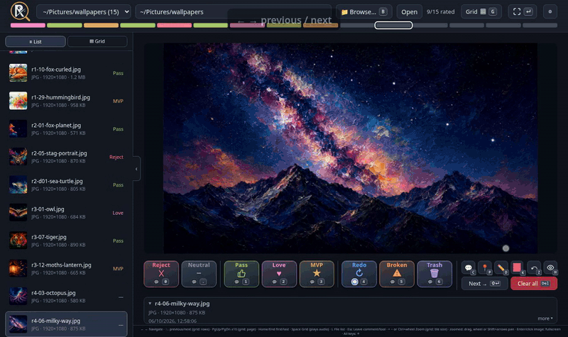
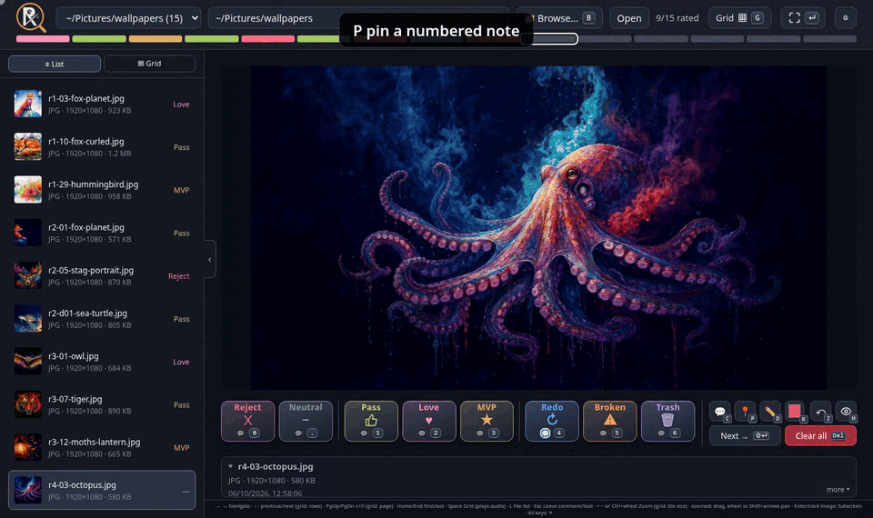
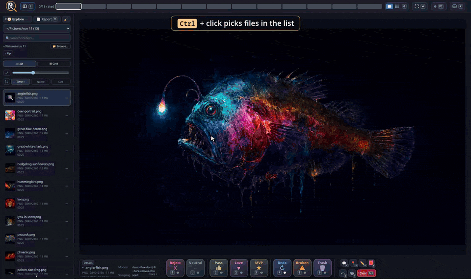
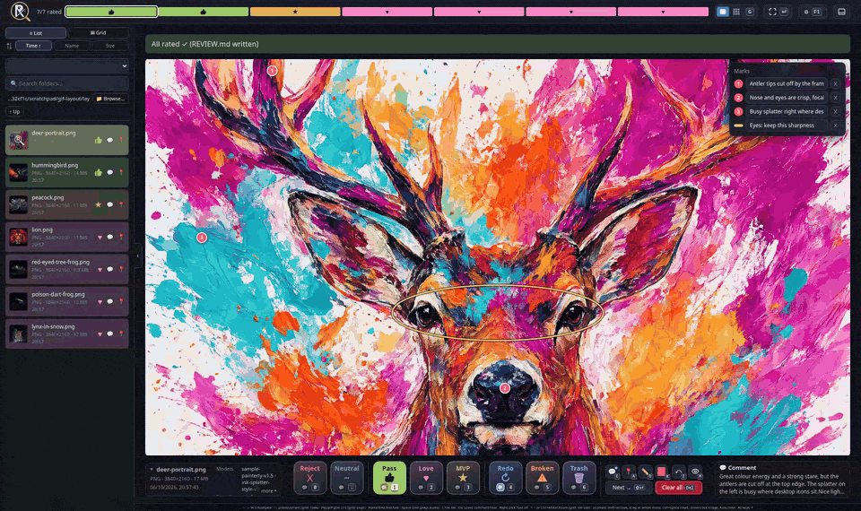
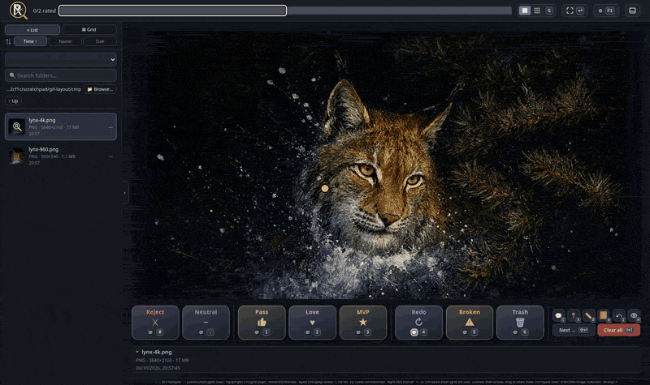
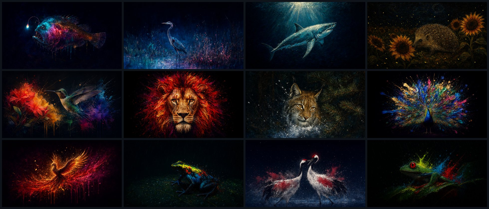

# RateBait

Tiny local web app for rating AI-generated images and music fast: numpad keys to rate (Reject → MVP) and flag (Redo, Broken, Trash), a comment per file, pins and drawings over the picture, a scrollable grid view, and a `REVIEW.md` summary per folder that an LLM can read to learn your taste. Python standard library only: no install, no build.

Made for a 4K screen at 50 inches. ¯\\\_(ツ)\_/¯ Screenshots: [docs/screenshot.png](docs/screenshot.png) (bottom layout), full-size 4K [docs/screenshot-4k.jpg](docs/screenshot-4k.jpg) (right-sidebar layout with docked Marks).


<details><summary><b>More demos:</b> navigation, annotation, multi-select, layout and settings, 4K vs low-res at the same zoomed spot</summary>

**Navigation:** arrows and W/S, Home/End, PgUp/PgDn, file list (☰ list or ▦ thumbnails, ⇅ sort by time/name/size, the open file marked with a lens, L hides it), F1 settings, grid with + − size, fullscreen, Ctrl+wheel zoom with hint bar, Shift+arrow pan, Ctrl+Space reset.



**Annotation:** pin a note (A), draw (D: free, Shift line, Ctrl box, Ctrl+Shift circle, Alt arrow, Alt+Shift cross), pen and pin colour (R: quick ring), undo (Z), hide marks (H), comment (C, Enter saves, Shift+Enter saves and moves on), Redo (4) and Broken (5) with the rating pop and its 💬 📍 ✏️ badges.



**Mode chip:** while Pin, Draw, the comment box or a multi-selection is on, a coloured pill at the top left of the picture (also in fullscreen) names the mode and the key that turns it off, and the picture area and the picture itself are outlined in that colour (Pin red, Draw yellow, Comment blue, Multi-select green).

**Multi-select:** Ctrl+click files in the list or grid (Shift+click picks a range), then one key rates or flags all of them; C + Enter gives them one comment; Redo asks for the comment first.



**Layout and settings:** ◫ or **X** switches to the right sidebar (numpad keys, docked Marks, comment box pops in over the picture); ⚙ Sizes: left sidebar 50–100 %, file list pictures 50–200 %, right sidebar 50–100 %, grid; Hint bars on/off; Rating buttons: colour, icon and title per button, then Reset; Keyboard: every key on a UK keyboard picture.



**Compare resolutions:** fullscreen keeps the zoom and spot when you switch files, so a 4K upscale and its 960×540 source can be checked side by side, one key apart.



</details>

[](https://www.buymeacoffee.com/philipplinux)

## Why "RateBait"?

No database, no memory service, no index to keep in sync. Every review leaves a trail of bait that the next person, script or LLM agent can pick up:

- **`REVIEW.md`** in each folder: plain Markdown, grouped by rating, with comments and marks. Easy to read, grep and diff, and to paste into a prompt.
- **Embedded data:** PNGs carry their own review in an iTXt chunk, next to the generation prompt and seed. Copy or move a file and its rating goes with it; RateBait reads it back in any folder.
- **File names:** the name links a picture to its review entry, its run log and its notes, so plain search finds every place it is mentioned.

Plain files and stable names link everything that matters, cheaply and reliably. Any tool that reads text can follow the trail.

## Setup

Setting it up with an AI agent, or letting one act on your reviews? Point it at [AGENTS.md](AGENTS.md).

- **Required:** Python 3.10+ and a modern browser. Nothing to install: clone and run.
- **Optional, for Browse…:** on Linux, PyGObject (`python3-gobject` on Fedora, `python3-gi` on Debian/Ubuntu) plus a running `xdg-desktop-portal`, which most desktops ship. Without it, Browse… falls back to Tk (`python3-tkinter` / `python3-tk`). Without either, type the folder path instead.
- **Folders:** pass `--root` per media folder, or set `MEDIA_RATER_ROOTS` once (e.g. in `~/.config/environment.d/`).

```bash
git clone https://github.com/philipplinux/ratebait
cd ratebait
python3 ratebait.py                        # scans the current directory → http://127.0.0.1:8765/
python3 ratebait.py --root ~/Pictures --root ~/Music --port 8765
```

**Try it first:** I included some 4K wallpapers in `sample-wallpapers/`, 13 of them. They're already rated, with comments, pins, drawings and made-up generation metadata (prompt, model, sampler). Start with `python3 ratebait.py --root sample-wallpapers` to see a finished review, including its `REVIEW.md`.



## Use

- Pick a discovered folder (**F** opens the list in the header; scans the roots up to 6 levels deep) or **Browse…** (also **B**/**O**) to any local folder. The top of the sidebar has a fuzzy folder search (a bare name searches every folder below the start folder, or all of home with **Search all of home** in ⚙; a path with `/` completes level by level; **Tab**/**→** take, **↑↓** pick, **Enter** opens; folders already shown below are left out), then the open folder with Browse… and 🧹 (removes every rating, flag, comment, pin and stroke in the folder, also from its PNGs, after a confirmation), then **↑ Up** and its subfolders with item counts. Hidden, `node_modules`-style and network-mounted folders are skipped and the list refreshes every 5 minutes. Roots: `--root` (repeatable), else `MEDIA_RATER_ROOTS` (colon-separated), else the current directory.
- Numpad layout: **0** Reject, **.** Neutral, **1–3** Pass · Love · MVP: rate and advance (old Good/Great/Bad ratings load as Pass/Pass/Reject); **← →** (or **W** / **S**) and **↑ ↓** navigate (in the grid ↑ ↓ move a row; on the first/last file ↑/↓ jumps to the other end); **PgUp/PgDn** skip 10 files (in the grid one page); **Home/End** first/last file; **Enter** or the fullscreen button beside ⚙: fullscreen (Enter or Esc closes); **C** comment in a floating bar (**Enter** saves it and, if the file already has a rating or flag, moves on; **Shift+Enter** or **Next →** beside Clear saves it and moves on, closing the bar; **Alt+Enter** starts a new line; **Esc** closes it; a saved comment stays in that bar, one line tall unless the text needs more; with ⚙ *Show a saved comment* off it shows in a box beside the file details instead, click it to edit); **Space** play/pause audio. **+ −** or **Ctrl+wheel** zoom the picture, also below 100%; when zoomed, **Shift+arrows**, drag or the wheel move it, **Ctrl+Space** resets. While zoomed a hint bar at the bottom of the picture shows the zoom level, these keys and Reset (⚙ *Hint bars* off: a small box bottom right instead). The next two pictures and the previous one are preloaded.
- After a rating or flag is saved its icon pops in the middle of the picture and fades; small 💬 (top), 📍 (bottom left) and ✏️ (bottom right) badges show when the file has a comment, pins or strokes. Rating keys pressed while a save is still running are queued, not dropped. **Shift+Enter** moves to the next file (also in the grid).
- **Ctrl+click** files in the file list (while it is visible) or in the grid to select several (the open file joins the selection); **Shift+click** selects every file from the last clicked one to this one, **Ctrl+Shift+click** adds that range. From 2 files on, an overlay shows the keys: a rating or flag key applies to all of them; **C**, type, **Enter** gives all of them the same comment, and a rating pressed afterwards sends both. Redo (or any button with 💬 on) first opens the comment box; **Enter** then sets it with that comment on all of them, replacing their old comments. **Esc** clears the selection; a plain click selects one file again.
- **4** Redo: request changes. Without a comment it stays (press again to remove it); with one it moves on (Redo → **C**, write → **Shift+Enter** or Redo again → next). A rating replaces any flag; red **Clear all** (**Delete**) removes rating, flag, comment, pins and drawing. **5** Broken: defective output, advance. **6** Trash: mark for deletion, advance. Press again to remove the flag. Each gets its own section in `REVIEW.md`; nothing is deleted automatically.
- **💬 checkbox** (top right of every button): comment mode. On, the button works like Redo: it sets the value but stays until there is a comment, then pressing it again moves on (or press again without a comment to undo). Off, ratings and flags move on straight away. On for Redo by default; remembered per browser.
- **⚙ Settings (top right, or F1):** a large window with sections side by side. **Layout:** file list on/off (also **L**, or the ◧ button beside the logo), rating buttons in a right sidebar (also **X** or the ◫ button right of ⚙; buttons arranged like a numpad, the comment box pops in over the bottom centre of the picture and, when the window is tall enough, the Marks panel docks under the mark tools), file details and generation info. **Fullscreen and hints:** previous/next thumbnails, a saved comment shown over the picture (single view and fullscreen), key hints while drawing, pinning or zoomed. **Sizes:** file list width 50–100% (scales everything in it), file list thumbnails 50–200% (in the sidebar grid, fewer or more columns), right sidebar 50–100%, grid columns × rows. **Folder search:** whether the path field searches all of home. **Rating buttons:** colour, icon and title for every button, plus names for up to three custom buttons on **7 8 9**; **Reset** restores the defaults. A named button appears next to Trash and works like a flag (press again to remove it); empty names hide it, and the **×** next to a name removes the button and the name saved in the open folder. Names are remembered per browser and saved into each folder, so `REVIEW.md` lists those files under their custom name. **Keyboard:** a UK keyboard with numpad where every bound key is coloured by what it does (hover for details), and the modifier and mouse combinations below it. Esc, F1 or × closes the window.
- **Single / grid switch (top right; Space/G):** the lit half shows the current view. Grid shows all files as a scrollable grid, 3 columns × 3 rows visible by default (set any size up to 10 × 10 in ⚙ Settings, or pick a preset: 2×1, 3×3, 10×10); **+ −** or **Ctrl+wheel** step the size (2×1, 2×2, 3×3 … 10×10; + gives fewer, bigger tiles, − more), Reset in the bottom-right box returns to 3×3; click a tile to select it, double-click for fullscreen, ↑↓ move by row; tiles show the filename (date-run prefix dropped) and the rating icon; ratings apply to the outlined tile. On an audio file, Space still plays/pauses; G opens the grid there.
- **Sidebar:** each file shows type, resolution, size and a short date (time for today, day and month this year; hover for the full timestamp). Under the folder controls, **☰ List** / **▦ Grid** buttons switch between the list and thumbnails only (3 per row by default, rating as a coloured underline); remembered per browser. Under them the **⤢ list scale** slider (same as ⚙ File list pictures) sets how many thumbnails fit per row in the grid and how dense the list is (below 100% rows tighten to one line, at 60% the grey line goes too); Below that **⇅** sorts by Time (default, oldest first), Name (A–Z, numbers in order) or Size; press the active one again to reverse it. Click ⤢ or ⇅ to fold its row into a small button beside List/Grid, and that button to open it again. The open file's thumbnail carries a white lens. In the list each file shows type · resolution · size in grey. Drag rows (or thumbnails) to put files in your own order for A/B comparing (dragging a selected file moves all selected files; Esc cancels); arrows, grid and progress bar follow it. The order is saved per folder in this browser; new files appear at the bottom, and **Reset** returns to oldest-first (newest at the bottom). While there is more to scroll, ▲ under the sort row and ▼ at the bottom show it; click one to jump to the first or last file.
- **Progress bar** (top): one tile per file in the rating's colour with its icon; the current file is outlined, a click jumps there. When a tile would get narrower than 8 px (many files, narrow window or zoomed in), the bar rolls up into one chip per rating with its count (e.g. ★ 2 MVP · ♥ 156 Love · — 7 Unrated); a chip jumps to the next file with that rating. Still too narrow, the chips drop their names and show icon and count only.
- **Live:** new folders and new files show up within 10 s, no reload needed.
- **Click an image or press Enter** for fullscreen: **+ −** or **Ctrl+wheel** zoom (at the cursor), also below fit; **Shift+arrows**, drag or the wheel move, **Ctrl+Space** resets; the bottom bar lists the keys and, while zoomed, a zoom bar above it shows the level, the zoom/move keys and Reset (the mode pill sits at the picture's top left, the pen and pin bars float centred over its top; ⚙ *Hint bars* hides all three); a file with a saved comment shows its comment box in fullscreen (one line tall unless the text needs more; ⚙ *Show a saved comment* off: only on **C**); click, Enter or Esc closes (while a pin or draw tool is active, clicks place marks; right-click turns the tool off). Small previous/next thumbnails with their rating icon sit at the left and right edges; click one to jump there (← → work too). The current picture's rating icon sits at the top centre. Turn the thumbnails off in ⚙ Settings.
- **📍 Pin (A) / ✏️ Draw (D):** marks drawn over the picture as an overlay; the file's pixels never change. Pin: click the image to drop a numbered pin and type its note in the field that opens beside it (**Enter** saves, **Esc** closes; click a pin to edit its note). The Marks panel lists pins and strokes (docked as a row under the rating buttons in the bottom layout or under the mark tools in the right sidebar when there is room, otherwise top right over the picture), each with an editable note or name; ✕ removes one; hidden when there are none. Draw: drag to draw in the chosen colour (**R** opens a ring of quick colours at the pointer, its middle 🎨 or a click on the colour swatch opens the full picker; new pins take the same colour); hold **Shift** for a straight line, **Ctrl** for a box, **Ctrl+Shift** for a circle around the start point, **Alt** for an arrow, **Alt+Shift** for a cross (the keys held on release decide); **Z**, **Ctrl+Z** or ↶ Undo removes the newest pin or stroke. A, D, C, Z, R and H also work in fullscreen, where the bottom bar lists the keys. The active tool lights up blue and the cursor turns into a pin or a pencil in the chosen colour; click it again, press its key again, **right-click** (on the picture or the Marks panel) or press **Esc** to turn it off (in fullscreen Esc closes the viewer). While a tool is on, an options row with its keys sits centred above the picture when the letterbox leaves room, otherwise over its top (single view and fullscreen); for the pen it also picks Free / Line / Box / Circle / Arrow / Cross for every stroke and the colour. **H** (the 👁 button left of the tools) hides or shows all marks and turns the active tool off. Marks are saved with the review (also embedded in PNGs), show in fullscreen too, and pins with their notes are listed in `REVIEW.md`.
- **File details** (box under the buttons): name, type, resolution, size, date and AI generation metadata. It is never taller than the buttons; when it's cut off, click it to show everything and click again to shrink it back. Hide it altogether in ⚙.
- Ratings are stored per folder in `.review.json`, and `REVIEW.md` is rebuilt on every change: a Markdown summary an LLM can read to learn your taste. Sample: [sample-wallpapers/REVIEW.md](sample-wallpapers/REVIEW.md).

  <details><summary>Excerpt of the sample report</summary>

  ```markdown
  # Media review

  - Folder: `ratebait/sample-wallpapers`
  - Updated: 2026-10-06T15:42:43+01:00
  - Progress: 13/13 rated · redo 1 · mvp 2 · love 6 · pass 3 · neutral 1 · reject 0 · broken 0 · trash 0 · unrated 0

  ## Redo / changes requested
  - `red-crowned-cranes.png` (image, neutral): Nice pairing and the red crowns pop, but the bodies dissolve into mush and the legs are cut off at the bottom. Redo with a cleaner render.
    - Pin 1 (57%, 23%): Red crown: great accent
    - Pin 2 (30%, 66%): Body turns into mush here
    - Pin 3 (72%, 95%): Legs cut off by the frame
    - Stroke 1 (#ff4d6d): Messy texture

  ## MVP / best
  - `peacock.png` (image): Best of the set. Symmetric fan, rich colour, lots of black around it so it crops well to any screen. Use as the hero image.
    - Pin 1 (51%, 56%): Head is small but sharp
    - Pin 2 (52%, 11%): Fan top has room to breathe
    - Pin 3 (51%, 89%): Legs fade nicely into black
    - Stroke 1 (#ffd166): Clean fan silhouette
  - `phoenix.png` (image): Huge energy, warm palette and drips that run into black. Works on any screen size; strong candidate for the hero image.
    - Pin 1 (43%, 37%): Head is small but readable
    - Pin 2 (66%, 20%): Wing tips burst out nicely
    - Pin 3 (55%, 85%): Drips fade into black: keep
    - Stroke 1 (#ffd166): Strong diagonal
  …
  ```

  </details>
- PNG files also carry their review in an embedded iTXt chunk (pixels and other metadata untouched, mtime kept). Copy a rated PNG into another folder and the rater picks up its rating there, so favourites can be promoted and demoted in a collection folder.
- Saves are atomic: `.review.json`, `REVIEW.md` and PNGs are written to a temporary file and then swapped in, so a failed write leaves the old file intact.

Images: PNG, JPG, WebP, GIF. Audio: MP3, FLAC, WAV, OGG, M4A, Opus. Listens on IPv4 loopback only; cross-origin POSTs are rejected. **Browse…** (**B** or **O**) opens the system folder dialog via the XDG desktop portal (needs PyGObject), falling back to Tk.

## Support

If RateBait saves you time: [](https://www.buymeacoffee.com/philipplinux)

## License

Copyright © 2026 philipplinux. Licensed under the GNU Affero General Public License v3.0 or later (AGPL-3.0-or-later), see [LICENSE](LICENSE). You may use, change and share it, including commercially, but you must keep the copyright notice and credit, and if you distribute a changed version or run one as a service for others, you must publish its source under the same license.
